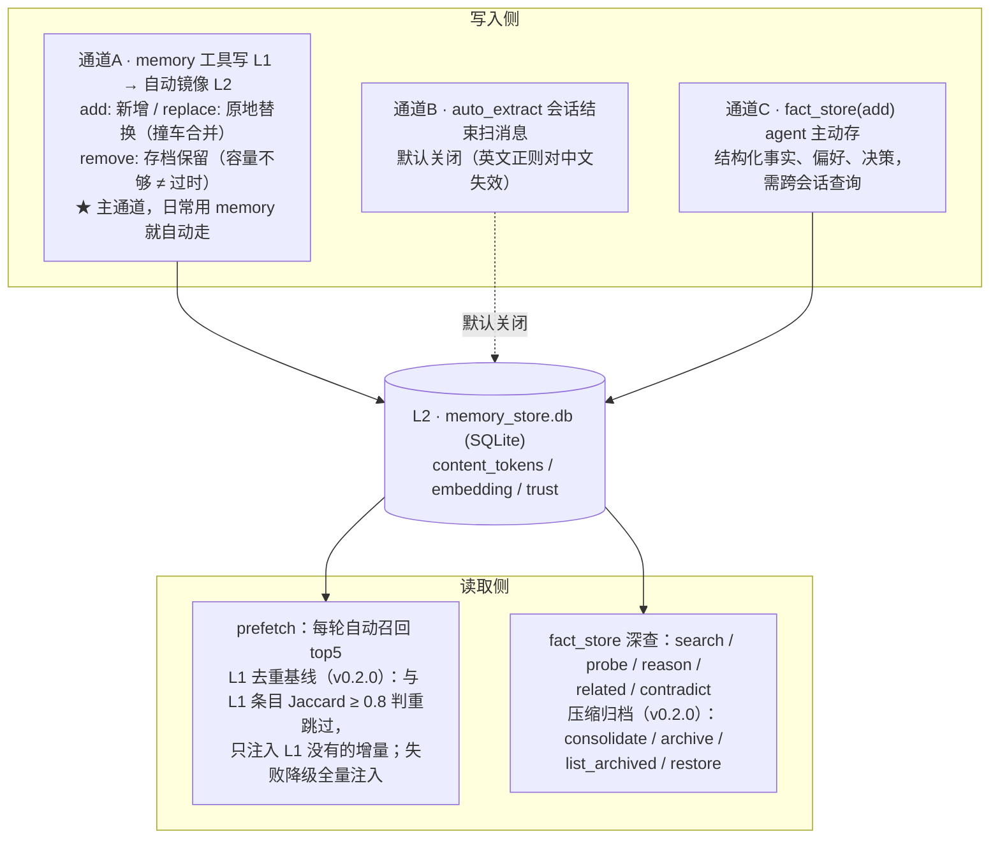

# hermes-memory-zh

<p>
  <a href="LICENSE"></a>
  <a href="https://www.python.org/"></a>
  <a href="https://github.com/fxsjy/jieba"></a>
  <a href="https://hermes-agent.nousresearch.com/"></a>
  <a href="https://linux.do/"></a>
</p>

**Hermes Agent 中文记忆插件** —— 轻量、纯本地 SQLite、开箱即用的中文记忆方案。在官方 Holographic 记忆插件的基础上叠加 jieba 中文分词，让中文记忆真正"搜得到、找得准"；embedding 语义检索为**可选增强**，没有 embedding 模型也完全不影响使用。

作为 Hermes 的**外部记忆提供者（L2）**运行，与内置的 MEMORY.md / USER.md（L1）**共存而非替换**。

---

## 为什么需要它

Hermes 内置的 Holographic 记忆插件用 SQLite FTS5 全文检索，但 FTS5 默认的 `unicode61` 分词器**不识别中文词边界**——整句中文被当成一个巨大 token 索引，导致：

- 存了「冰的黑咖啡」，搜「冰黑咖啡」返回零结果
- 中文自然语言查询召回率极差

`hermes-memory-zh` 从官方源码 fork，核心改动：

1. **jieba 中文分词** —— 写入时把中文预切词存入独立的 FTS5 索引，检索按 AND → OR → 回退三步策略
2. **混合打分重排** —— FTS5 + Jaccard + HRR 三路信号混合排序（可选第 4 路 embedding）
3. **可选 embedding 语义检索** —— 有 OpenAI 兼容网关就开启，没有就纯本地跑，零外部依赖

## 特性

- ✅ **轻量本地化** —— 纯 SQLite 单文件库，无需任何外部服务即可运行；jieba 分词 + FTS5 + HRR 全部离线完成
- ✅ **jieba 中文分词** + tokenized FTS5 索引，中文 AND/OR/回退三步检索
- ✅ **FTS5 真实 rank** —— BM25 归一化到 [0,1]，不是硬编码常数
- ✅ **优雅降级** —— jieba / numpy / embedding 任一缺失都不崩，自动回退
- ✅ **embedding 可选增强** —— 默认关闭；开启后接入任意 OpenAI 兼容网关（如 DashScope），混合打分升级为 4 信号：FTS5(0.25) + Jaccard(0.15) + HRR(0.20) + Embedding(0.40)
- ✅ **config 全驱动** —— base_url / model / dim / weight 全部可配，零硬编码
- ✅ **独立插件** —— 装到 `~/.hermes/plugins/`，`hermes update` 不覆盖
- ✅ **与 L1 共存** —— MEMORY.md 继续每轮注入，本插件作为检索式 L2 叠加
- ✅ **prefetch L1 去重（v0.2.0）** —— 召回注入前以 L1 条目为已见基线（jieba Jaccard ≥0.8 判重），只注入增量事实，消除 L1 已常驻又被重复注入的 token 浪费；失败自动降级全量注入
- ✅ **写侧压缩归档（v0.2.0，手动触发）** —— `fact_store` 新增 4 动作：`consolidate`（相似事实合并）/ `archive`（低信任陈旧事实打标记不删除，检索自动过滤）/ `list_archived` / `restore`
- ✅ **配套记忆同步工具** —— `scripts/` 内置跨机同步/还原脚本：SQL 文本 dump 为主源（可 diff 审计）+ 一致性快照兜底，内容指纹判新旧，运行中还原走 SQLite 锁安全
- ✅ **MIT 许可** —— 继承官方，含完整版权声明

## 与官方方案的对比

|               | 官方 holographic | **hermes-memory-zh** |
| ------------- | ---------------- | -------------------- |
| 中文分词      | ❌ 无            | ✅ **jieba**         |
| 混合打分      | 3 信号           | ✅ **3~4 信号**（embedding 可选） |
| FTS rank      | 正确             | ✅ **正确**          |
| 安装方式      | 内置             | ✅ **独立插件**      |
| hermes update | 会重置           | ✅ **不覆盖**        |
| 跨机记忆同步  | 无               | ✅ **内置脚本**      |

## 安装

```bash
# 从 Git 仓库安装（发布后）
hermes plugins install blacksamuraiiii/hermes-memory-zh --enable

# 或手动放到插件目录
mkdir -p ~/.hermes/plugins/hermes-memory-zh
cp -r hermes_memory_zh/* ~/.hermes/plugins/hermes-memory-zh/

# 启用为记忆提供者
hermes config set memory.provider hermes-memory-zh

# 安装分词依赖（jieba 必需；openai 仅在启用 embedding 时需要）
pip install jieba
```

重启 Hermes（`/restart` 或 `hermes gateway restart`），`hermes memory status` 确认插件已激活。

## 运行测试

```bash
# 使用 hermes 自带 venv（含 jieba/openai/numpy 依赖）
~/.hermes/hermes-agent/venv/bin/python -m pytest tests/ \
  PYTHONPATH=~/.hermes/hermes-agent
```

> 测试依赖 Hermes core 模块（`hermes_state_registry` 等），需将 `PYTHONPATH` 指向 hermes-agent 安装/源码目录；测试数据全部为中性示例，不依赖任何真实环境。

> 记忆按 L1/L2 分层：内置 MEMORY.md / USER.md 继续每轮注入，本插件作为 L2 提供大规模事实的语义检索，两者不冲突。

## 配置

在 `~/.hermes/config.yaml`：

```yaml
plugins:
  hermes-memory-zh:
    db_path: ~/.hermes/memory_store.db
    auto_extract: false  # 默认关闭：内置英文正则对中文失效，开着零产出；日常以 L1 镜像为主通道
    default_trust: 0.5
    hrr_dim: 1024
    # —— 中文分词：装 jieba 即自动启用，无额外配置 ——
    # —— 语义检索（可选增强，默认关闭）——
    embedding_enabled: false
    # embedding_model: text-embedding-v4   # 或 bge-m3 等（见下方"Embedding 可选增强"）
    # embedding_dim: 1024
    # embedding_weight: 0.4
    # openai_base_url: https://your-gateway/v1   # 填你的 OpenAI 兼容 embedding 网关
    # openai_api_key: ""                          # 留空则从环境变量取
```

默认配置下插件**零外部依赖**：jieba 分词 + FTS5 + HRR 混合检索全部本地完成。需要语义检索时把 `embedding_enabled` 改为 `true` 并配置网关即可；`openai_api_key` 为空时依次尝试环境变量 `DASHSCOPE_API_KEY`、`OPENAI_API_KEY`。

## Embedding 可选增强

插件**不绑定任何 embedding 模型，也不要求你配置一个**——这是可选项。只要你有一个暴露 OpenAI 兼容 `/v1/embeddings` 端点的网关，改 `embedding_model`（和必要时 `embedding_dim`）即可获得第 4 路语义信号。常用模型：

| 模型                       | 维度                          | 特点                                                                  | 典型来源                          |
| -------------------------- | ----------------------------- | --------------------------------------------------------------------- | --------------------------------- |
| `text-embedding-v4`      | 64~2048 可自定义（默认 1024） | 通义（Qwen3）多语言统一向量模型，检索/聚类/分类强，较 v3 提升 15%~40% | DashScope 兼容模式                |
| `bge-m3`                 | 1024                          | 多语言（100+）、开源主流、社区验证多                                  | DashScope / 各类 AI 网关 / 自部署 |
| `text-embedding-3-small` | 1536                          | OpenAI 官方                                                           | OpenAI                            |

> ⚠️ 换模型即换向量空间：新旧 embedding 不可混用，切换后请对已有 facts 重新生成向量（backfill）。

## 数据流架构

记忆写入有三条通道，读取有两条路径：**L1（MEMORY.md / USER.md 策展文件）是人工策展的事实源，L2（SQLite 事实库）是机器检索的事实库**。日常通过 `memory` 工具写 L1，会自动镜像到 L2；两条读取路径互不干扰，各取所长。



### 三通道契约

- **通道A（L1 镜像）**：`memory` 工具 `add` / `replace` 自动同步到 L2，`remove` 存档保留（容量不够 ≠ 过时）。`replace` 采用 `mirror_replace` 三路合并——正常替换 → 原地更新；撞车（新内容已存在）→ 删旧留新；旧内容未镜像 → 直接添加。这是主通道，日常用 `memory` 就自动走，无需任何额外配置。
- **通道B（auto_extract）**：默认关闭。内置英文正则对中文无效，开着零产出；若后续需要，可上 LLM 提取方案。
- **通道C（fact_store add）**：agent 主动判断值得沉淀的结构化事实、偏好、决策，直接写入 L2，供跨会话深度查询。

## 原理

```
写入：内容变化 → jieba 分词 → 重算 facts.content_tokens
      → 重算 HRR 向量 → 重算 embedding 向量（若启用）→ 更新 facts
      （update_fact 必须三样一起重算：content_tokens / HRR / embedding，
        否则改内容后旧向量不匹配新语义，检索失效——这是已修复的 bug）

检索：中文查询 → jieba 分词
      → Step1 tokenized AND（全词命中，最精确）
      → Step2 tokenized OR（任一词命中，更宽）
      → Step3 回退 unicode61（英文/无 jieba）
      → 混合打分重排：FTS5 + Jaccard + HRR（+ Embedding，若启用）
```

## 跨机记忆同步（scripts/）

多台机器使用 Hermes 时，记忆库（SQLite）不能直接 rsync——热库 WAL 不一致、二进制膨胀、并发锁都可能损坏数据。`scripts/` 内置 v2 同步方案：

| 文件 | 作用 |
|---|---|
| `scripts/memory-sync.py` | 同步引擎：`push`（生成 SQL dump + 一致性快照）/ `restore`（SQL 还原 + FTS rebuild）/ `verify`（完整性校验） |
| `scripts/memory-restore.sh` | 还原入口：`check`（只报告）/ `apply`（强制还原）/ `apply --yes`（无人值守） |

**设计要点：**

- 云端（如一个私有 git 仓库的 `snapshots/`）只维护**两个固定文件**作为唯一真源：`memory.sql`（SQL 文本 dump，可 diff 审计）+ `memory_store.snapshot.db`（一致性快照兜底）
- 判断"是否需要还原"靠 **facts 逻辑内容指纹**（COUNT + MAX(updated_at) + 逻辑字段 md5），不依赖文件 mtime（Hermes 打开库会刷新 wal mtime，不可靠）
- **SQL 还原走 SQLite 事务锁，Hermes 运行中安全**；快照 cp 兜底只在 Hermes 未运行时执行
- 还原前自动备份本地库为 `.bak`；push 前强制 `PRAGMA integrity_check`，损坏的库拒绝生成真源，防止污染云端

```bash
# 推送（机器 A 用完）
python3 scripts/memory-sync.py push && cd ~/hermes-sync && git add snapshots/ && git commit -m "memory sync" && git push

# 检查/还原（机器 B 开工前）
bash scripts/memory-restore.sh check
bash scripts/memory-restore.sh apply
```

路径可通过环境变量覆盖：`HERMES_MEMORY_DB`（默认 `~/.hermes/memory_store.db`）、`HERMES_SYNC_REPO`（默认 `~/hermes-sync`）。

## 致谢

本项目基于以下开源工作，特此致谢：

- **[NousResearch/hermes-agent](https://github.com/NousResearch/hermes-agent)** —— 本项目 fork 自其内置的 **Holographic Memory Provider**（`plugins/memory/holographic`），由 **dusterbloom** 于 PR #2351 贡献，后适配到 MemoryProvider ABC。底层 store / retrieval / HRR 实现均源自此，版权归 Nous Research。
- **[Songokou1983/holographic-zh](https://github.com/Songokou1983/holographic-zh)** —— 提供 jieba 中文分词 + OpenAI embedding 语义检索的思路参考。本项目的混合打分与降级设计受其启发，并修复了其 `fts_rank` 被硬编码为 0.5 的缺陷。
- **[kyan001/Holographic-CHS-for-Hermes](https://github.com/kyan001/Holographic-CHS-for-Hermes)** —— 提供中文 FTS5（trigram）与「独立插件、不覆盖官方文件」的安装/分发思路参考。

三者均为 MIT 许可。本项目保留了官方源码的版权声明，详见 [LICENSE](LICENSE)。

## LICENSE

[MIT](LICENSE)
